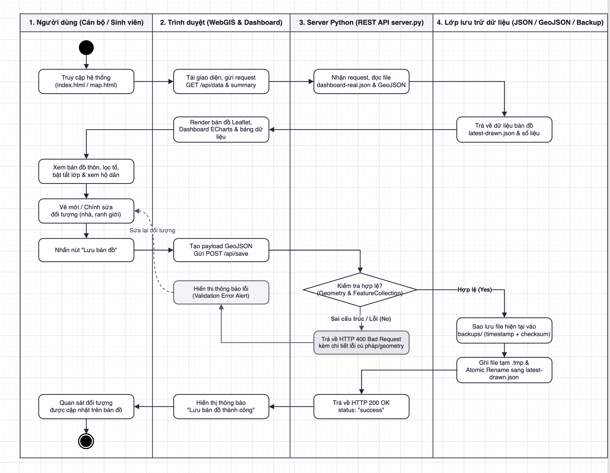
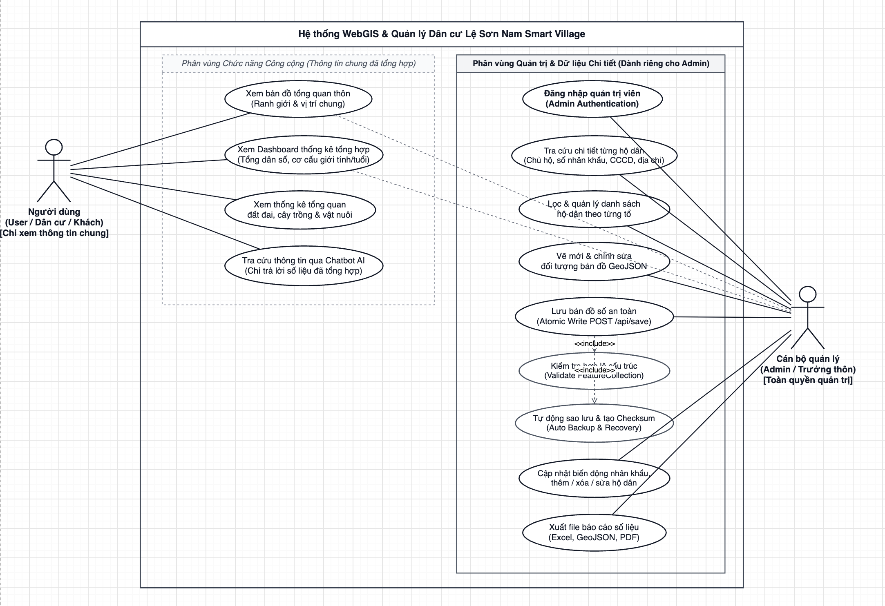
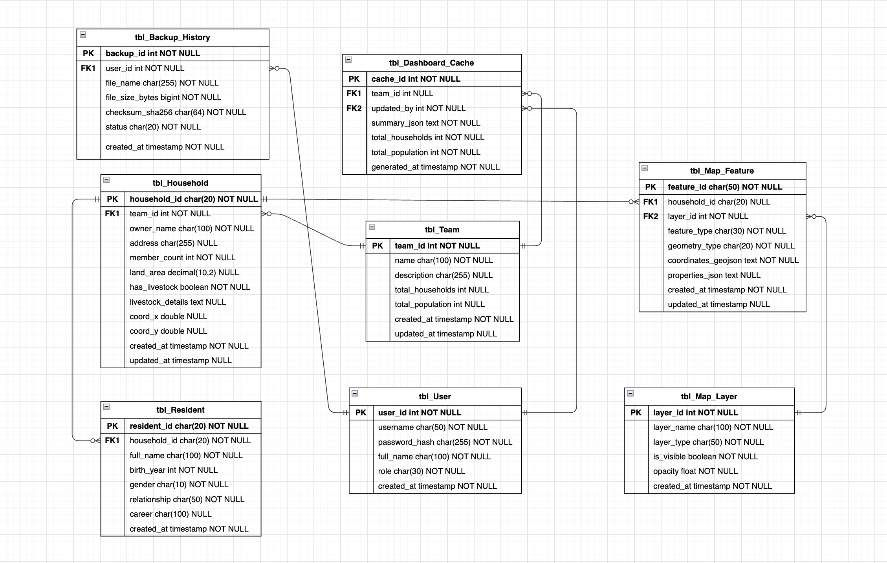

# 📐 VKU Diagram Skill

> **Bộ công cụ & Quy chuẩn thiết kế sơ đồ UML (Activity, Use Case, Class & Database ERD) chuẩn in ấn báo cáo / luận văn tốt nghiệp Đại học Công nghệ Thông tin & Truyền thông Việt - Hàn (VKU).**

---

## 📌 1. Giới thiệu tổng quan

Trong quá trình làm đồ án cơ sở, đồ án chuyên ngành, báo cáo thực tập và luận văn tốt nghiệp tại **VKU**, sinh viên thường gặp các vấn đề:
1. **Lỗi định dạng khi in ấn A4:** Sơ đồ dùng nhiều màu sắc sặc sỡ (xanh, đỏ, cam, gradient) khi in đen trắng trên máy in văn phòng sẽ bị nhòe, tối đen hoặc chữ chìm vào nền không đọc được.
2. **Sai chuẩn UML 2.5:** Vẽ mũi tên tùy tiện, nhầm lẫn giữa quan hệ Kế thừa (`--|>`), Hợp thành (`*--`), Liên kết (`--`) và Phụ thuộc (`..>`), hoặc vẽ Use Case thiếu ranh giới hệ thống (`System Boundary`).
3. **Sơ đồ CSDL không đồng nhất:** Không dùng đúng định dạng bảng thực thể của Draw.io (Draw.io Native Table), thiếu phân biệt khóa chính (PK), khóa ngoại (FK) và đường nối chân quạ (Crow's Foot) bị lệch dòng.

**VKU Diagram Skill** giải quyết triệt để các vấn đề trên bằng cách chuẩn hóa 100% mẫu hình khối, cú pháp XML gốc của Draw.io và cung cấp sẵn các đoạn mã Node.js để sinh sơ đồ tự động kèm liên kết mở trực tiếp trên web.

---

## 📂 2. Cấu trúc thư mục

```text
VKU_diagram_skill/
├── README.md                    # Hướng dẫn sử dụng nhanh và tổng quan bộ công cụ
├── SKILL.md                     # Đặc tả kỹ năng cho AI Antigravity (Prompt system & XML syntax)
├── scripts/                     # Thư viện script sinh sơ đồ tự động bằng Node.js
│   ├── drawio_url_helper.js     # Tiện ích nén Raw Deflate + Base64 tạo link Draw.io mở tức thì
│   ├── generate_activity.js     # Script mẫu tạo Activity Diagram (luồng đơn & phân làn swimlanes)
│   └── generate_class_erd.js    # Script mẫu tạo Class / ERD Table 2 cột & đường nối Crow's Foot
└── examples/                    # Bộ sưu tập file .drawio & hình ảnh tham chiếu trực quan
    ├── reference_activity_diagram.png                      # [Image] Sơ đồ Activity Diagram 4 làn phân vai trò
    ├── reference_usecase_diagram.png                       # [Image] Sơ đồ Use Case Diagram phân vùng bảo mật
    ├── reference_class_erd_diagram.png                     # [Image] Sơ đồ Class Diagram & CSDL 2 cột Native
    ├── WebGIS_Activity_Diagram_BaoCaoTotNghiep.drawio      # [Draw.io] Quy trình lưu nguyên tử Atomic Save
    ├── Checkin_Workflow_Activity_Diagram.drawio            # [Draw.io] Quy trình Check-in công việc hàng ngày
    ├── WebGIS_Usecase_Diagram_BaoCaoTotNghiep.drawio       # [Draw.io] Sơ đồ Use Case phân quyền bảo mật cao
    ├── General_Usecase_Diagram.drawio                      # [Draw.io] Sơ đồ Use Case tổng quan phân hệ
    ├── WebGIS_Class_Diagram_BaoCaoTotNghiep.drawio         # [Draw.io] Class Diagram & CSDL 7 bảng chuẩn
    └── BaoCao_TotNghiep_Diagrams_Full.drawio               # [Draw.io] File dự án đa trang (Multi-page Draw.io)
```

---

## 🎨 3. Quy chuẩn in ấn A4 đơn sắc (Monochrome Guidelines)

Toàn bộ sơ đồ trong bộ skill này tuân thủ bảng mã màu đơn sắc chuẩn mực:

| Thành phần | Mã Hex | Ghi chú thiết kế |
| :--- | :---: | :--- |
| **Nền sơ đồ / Canvas** | `#FFFFFF` | Trắng tuyệt đối, không dùng lưới nền khi xuất ảnh |
| **Nền Tiêu đề bảng / Header** | `#F3F4F6` | Xám nhạt cao cấp (10% xám), chữ đen đậm |
| **Viền khối / Stroke Border** | `#111827` hoặc `#374151` | Đen tuyền / Xám đậm, nét đơn solid `1.3px` - `1.6px` |
| **Màu chữ / Font Color** | `#111827` | Đen 100%, font chữ không chân (Helvetica/Arial) hoặc Times New Roman |
| **Đường nối / Connectors** | `#111827` | Nét liền cho luồng chính, nét đứt cho `<<include>>` hoặc phân tách PK/FK |

> ⚠️ **Quy tắc vàng:** Tuyệt đối không bật hiệu ứng đổ bóng (`shadow=0`) và không dùng màu gradient để đảm bảo chất lượng in ấn sắc nét nhất.

---

## 📊 4. Các loại sơ đồ hỗ trợ & Cú pháp Draw.io chuẩn

### 4.1. Activity Diagram (Sơ đồ hoạt động)
* **Điểm bắt đầu (Start Node):** Khối tròn đen đặc kích thước 30x30px (`shape=startState;fillColor=#111827;strokeColor=none`).
* **Điểm kết thúc (End Node):** Khối lồng tròn viền kép 30x30px (`shape=endState;fillColor=#111827;strokeColor=#FFFFFF;strokeWidth=2`).
* **Hành động (Action State):** Chữ nhật bo tròn góc mềm (`rounded=1;arcSize=20;fillColor=#FFFFFF;strokeColor=#111827`).
* **Điểm rẽ nhánh (Decision):** Hình thoi 40x40px (`rhombus;fillColor=#FFFFFF`), các nhánh ra có nhãn điều kiện đặt trong ngoặc vuông `[Hợp lệ]`, `[Lỗi]`.
* **Thanh đồng bộ (Fork / Join Bar):** Thanh ngang màu đen đặc (`shape=line;strokeWidth=4;strokeColor=#111827`).
* **Phân làn (Swimlanes / Partitions):** Khối làn riêng biệt cho `User`, `Web Client`, `Server API`, `Database`.

> 🖼️ **Hình ảnh mẫu chuẩn (Activity Diagram 4 Làn phân vai trò):**
> 
> 

---

### 4.2. Use Case Diagram (Sơ đồ trường hợp sử dụng)
* **Khung ranh giới (System Boundary):** Dùng swimlane cố định viền nét mảnh (`collapsible=0;strokeWidth=1.5`).
* **Tác nhân (Actor):** Hình người que chuẩn UML (`shape=umlActor;strokeWidth=1.6`).
* **Trường hợp sử dụng (Use Case):** Hình elip nền trắng viền đen (`shape=ellipse`).
* **Quan hệ phụ thuộc:**
  * Quan hệ gọi bắt buộc: Mũi tên nét đứt có nhãn `<<include>>` hướng về Use Case con.
  * Quan hệ mở rộng: Mũi tên nét đứt có nhãn `<<extend>>` hướng về Use Case cha.
* **Bảo mật phân quyền (Privacy Boundary):** Tách bạch rõ rệt giữa Actor phổ thông (chỉ đọc số liệu tổng hợp) và Actor Quản trị viên (truy cập dữ liệu cá nhân PII và quyền ghi đĩa).

> 🖼️ **Hình ảnh mẫu chuẩn (Use Case Diagram phân vùng bảo mật & <<include>>):**
> 
> 

---

### 4.3. Class Diagram & Database ERD (Draw.io Native Table)
* **Bảng thực thể:** Cấu trúc bảng 2 cột gốc của Draw.io (`shape=table;childLayout=tableLayout`).
* **Cột trái (PK / FK):** Chiều rộng 38px, có đường chia nét đứt dọc bên phải (`right=1;dashed=1`).
* **Hàng khóa chính cuối cùng:** Có đường viền đáy nét liền (`bottom=1`) để ngăn cách với các thuộc tính thông thường.
* **Đường nối chân quạ (Crow's Foot):** Kiểu nối `edgeStyle=entityRelationEdgeStyle` với đầu mũi tên:
  * `ERmandOne` (`||`): 1 bắt buộc.
  * `ERzeroToMany` (`o{`): 0 đến nhiều tùy chọn.
  * `ERoneToMany` (`|{`): 1 đến nhiều bắt buộc.

> 🖼️ **Hình ảnh mẫu chuẩn (Class Diagram & Database Schema ERD 2 cột Native Table):**
> 
> 

---

## 🚀 5. Hướng dẫn sử dụng

### 5.1. Dùng cùng Trợ lý AI Antigravity
Khi cần AI vẽ bất kỳ sơ đồ nào, bạn chỉ cần ra lệnh tự nhiên kèm từ khóa:
* *"Vẽ cho tôi activity diagram quy trình đăng nhập theo chuẩn VKU_diagram_skill"*
* *"Dùng VKU_diagram_skill để tạo class diagram và database schema"*
* *"Xuất use case diagram phân quyền người dân và cán bộ"*

AI sẽ tự động nạp `SKILL.md`, sinh file `.drawio` chuẩn monochrome và tạo đường dẫn web mở trực tiếp cho bạn chỉnh sửa.

### 5.2. Chạy Script sinh mã tự động (Node.js)
Trong thư mục `scripts/`:

```bash
# 1. Sinh sơ đồ Activity Diagram mẫu và lấy URL Draw.io
node scripts/generate_activity.js

# 2. Tạo link mở trực tiếp trên web từ bất kỳ file XML nào
node -e "const { getDrawioUrl } = require('./scripts/drawio_url_helper'); console.log(getDrawioUrl('<mxfile>...</mxfile>'));"
```

### 5.3. Cách mở và chỉnh sửa trên Draw.io
1. **Cách 1 (Nhanh nhất):** Nhấp vào liên kết `https://app.diagrams.net/#create=...` do script sinh ra để mở trực tiếp sơ đồ trên trình duyệt.
2. **Cách 2:** Truy cập [app.diagrams.net](https://app.diagrams.net) &rarr; Chọn `Open Existing Diagram` &rarr; Chọn file `.drawio` trong thư mục `examples/`.
3. **Cách 3:** Kéo thả trực tiếp file `.drawio` vào giao diện Draw.io.

### 5.4. Xuất file chèn vào Word / Google Docs / LaTeX
* **Vào báo cáo Word / Google Docs:** Trên Draw.io, chọn `File` &rarr; `Export as` &rarr; `PNG` (chọn DPI 300 để in sắc nét) hoặc `SVG` (ảnh vector không vỡ hạt).
* **Vào slide thuyết trình:** Xuất định dạng `SVG` hoặc `PDF` trong suốt.

## 🏛️ 6. Thông tin tham chiếu chuẩn

* **Tiêu chuẩn học thuật:** Quy chuẩn đồ án chuyên ngành & khóa luận tốt nghiệp Trường Đại học Công nghệ Thông tin & Truyền thông Việt - Hàn (VKU), Đại học Đà Nẵng.
* **Hệ thống áp dụng thực tế:** Hệ thống WebGIS hỗ trợ quản lý nhà ở, hộ dân và tổ dân cư kết hợp Dashboard thống kê, Chatbot tra cứu dữ liệu.
* **Phạm vi ứng dụng:** Phù hợp cho các đề tài Hệ thống Thông tin, Kỹ thuật Phần mềm, Khoa học Máy tính và các ứng dụng Web/GIS.
